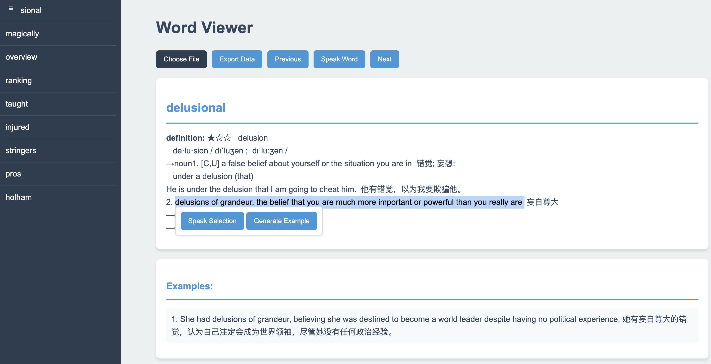

# Project Origin
This project originated from the author's frustration when listening to English podcasts, struggling with unfamiliar words and finding it cumbersome to look them up individually. Thus, the goal was to automate the process of generating a vocabulary list of difficult words.

# Difficult English Word Viewer
The Difficult English Word Viewer allows users to upload audio/text and automatically generates a vocabulary list of challenging words, providing a convenient way to review them.

## Main Features

- Supports uploading word list files in various formats (txt, md, rtf, mp3, wav, ogg, flac, json)
- Automatically generates a vocabulary list of difficult words
- View word definitions and example sentences
- Generate new example sentences for words
- Export word data in JSON format

## Installation Steps

1. Clone the repository:
   ```
   git clone https://github.com/adot08/audio-to-word-list-generator.git
   cd audio-to-word-list-generato
   ```

2. Create and activate a virtual environment:
   ```
   python -m venv venv
   # On Windows, use:
   venv\Scripts\activate
   # On macOS and Linux, use:
   source venv/bin/activate
   ```

3. Install required packages:
   ```
   pip install -r requirements.txt
   ```

## Usage Instructions

1. Start the Flask application:
   ```
   python app.py
   ```

2. Visit `http://localhost:5000` in your web browser

3. Use the "Choose File" button to upload a word list file

4. Interact with the loaded words using the provided buttons and features

## Notes
1. For larger audio files, the waiting time can be longer, mainly due to file segmentation and ASR. Subsequent AI-generated explanations will also take some time, which is related to the number of difficult words, so please be patient when using.
2. Processed files can be exported and imported directly for future use.

## Configuration

- All optional configurations are in config.yaml, where you can modify the ASR service and LLM service you need to use. In this project, I chose SiliconFlow's service, which provides a comprehensive set of services, making it convenient for expansion and model switching.

