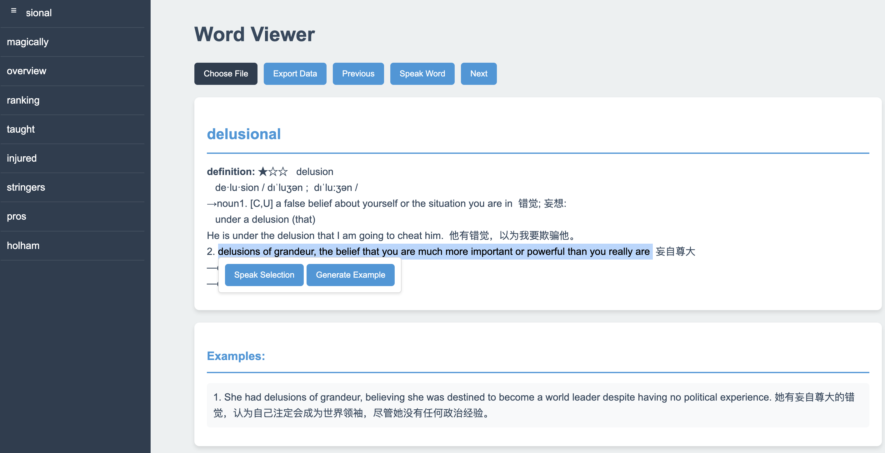

# 项目起源
本项目源于作者在听英文播客时，苦恼有好些生词听不懂，一个个查又比较费劲。因此希望能够自动化的生成难词单词本。

# 难英文单词查看器（Word Viewer）
难英文单词查看器允许用户上传音频/文本，然后自动化的生成难词单词本，并提供了方便的查阅方式。

## 主要功能

- 支持上传多种格式的单词列表文件（txt, md, rtf, mp3, wav, ogg, flac, json）
- 自动生成难词单词本
- 查看单词定义和例句
- 为单词生成新的例句
- 将单词数据导出为 JSON 格式

## 安装步骤

1. 克隆仓库：
   ```
   git clone ...
   cd word-viewer
   ```

2. 创建并激活虚拟环境：
   ```
   python -m venv venv
   # 在 Windows 上使用：
   venv\Scripts\activate
   # 在 macOS 和 Linux 上使用：
   source venv/bin/activate
   ```

3. 安装所需的包：
   ```
   pip install -r requirements.txt
   ```

## 使用说明

1. 启动 Flask 应用：
   ```
   python app.py
   ```

2. 在网页浏览器中访问 `http://localhost:5000`

3. 使用"选择文件"按钮上传单词列表文件

4. 使用提供的按钮和功能与加载的单词进行交互

## 注意事项
1. 对于较大的音频文件，等待时间会比较长，主要耗时在文件切块和ASR。后续AI生成解释也会占据一些时间，这与难词数有关系，所以使用时请耐心等待。
2. 处理过的文件可以导出，下次使用时可以直接导入。

## 配置说明

- 所有可选的配置都在config.yaml中，你可以修改你需要用到的ASR服务和LLM服务。在这个项目我选择了硅基(SiliconFlow)的服务，硅基提供了较全的服务，方便扩展和切换模型。

